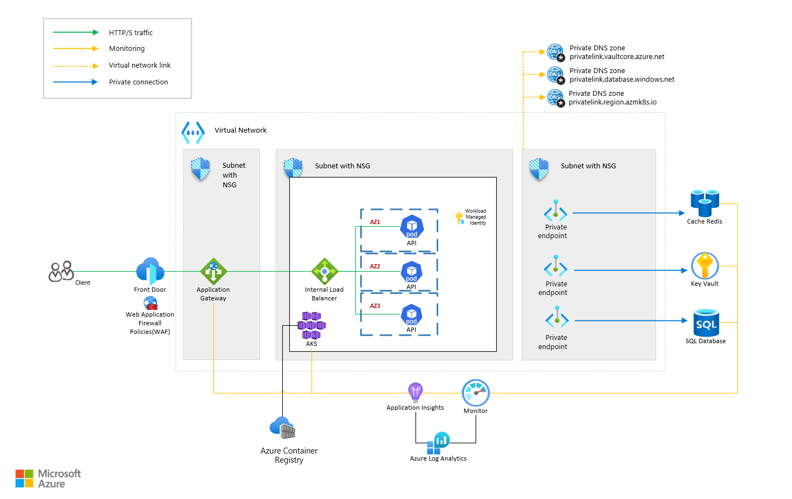
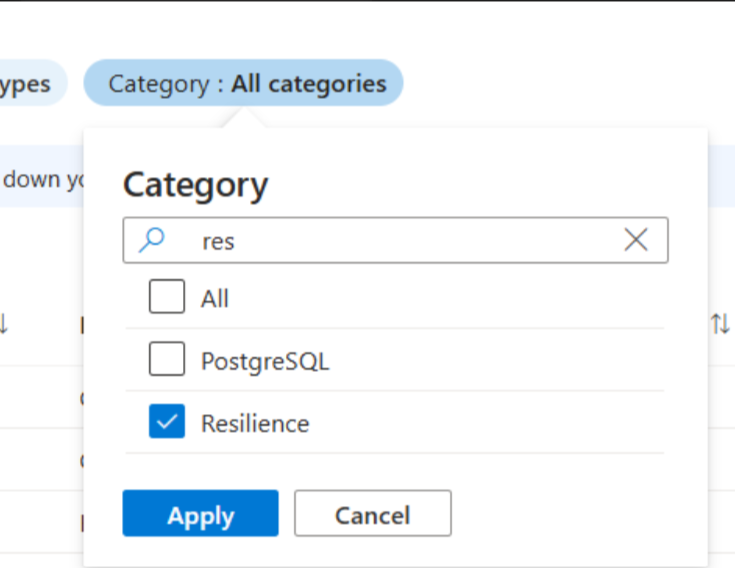

# Resilient ECommerce Reference Application

The Resilient ECommerce Reference Application is a synthetic workload that mirrors a simple, bare-bones, e-commerce platform. The purpose of it is to demonstrate how to use Azure Resiliency best practices to achieve availability during zonal outages or components outages.

The application has been tested for resiliency during simulated zonal outages and has performed as expected, keeping a high availability of the service with minimal impact to end users. Currently, it is being used by internal Microsoft teams for regression testing and new region buildouts, providing valuable telemetry to Azure service owners with regards to availability, recovery, service behavior and end user experience.

Follow the instructions in [the setup readme file](doc/SETUP.md) to start using the app. It can be used for educational purposes or as a starting point for developing new resilient applications.

## Content

- [Why does resiliency matter?](#why-does-resiliency-matter)
- [Azure regions and availability zones (AZ)](#azure-regions-and-availability-zones-az)
- [Application structure](#application-structure)
  - [The API](#the-api)
  - [Networking architecture](#networking-architecture)
  - [Storage architecture](#storage-architecture)
  - [Compute architecture](#compute-architecture)
- [Other Considerations](#other-considerations)
  - [Scalability](#scalability)
  - [Monitoring](#monitoring)
  - [Security](#security)
- [Stay Resilient using Azure Policies](#stay-resilient-using-azure-policies)
- [Cost optimization](#cost-optimization)
- [Hands-on experiments](#hands-on-experiments)
  - [Deploy the App](#deploy-the-app)
  - [Simulating a zone-down (Chaos Studio)](#simulating-a-zone-down-chaos-studio)
    - [Azure Chaos Studio Overview](#azure-chaos-studio-overview)
    - [Using Chaos Studio to Test Zone Resiliency](#using-chaos-studio-to-test-zone-resiliency)

## Why does resiliency matter?

Building zone-resilient systems guarantees high availability by distributing resources across multiple availability zones, minimizing the impact of localized outages. This not only keeps critical applications running smoothly but also enhances user trust and business continuity. A resilient architecture maximizes uptime, reduces downtime risks, and helps organizations meet stringent reliability standards, safeguarding both performance and customer satisfaction.

Azure provides a robust suite of tools and services designed for high availability, scalability, and disaster recovery. Azure\'s global network of data centers allows customers to deploy applications across multiple regions, ensuring that applications remain available even if a regional failure occurs.

Using cloud native services allows customers to leverage built-in redundancy features, such as Azure Availability Zones and Azure Site Recovery, safeguard against hardware failures and natural disasters. Additionally, Azure's auto-scaling capabilities enable applications to handle varying traffic loads without downtime. With integrated monitoring and security tools like Azure Monitor and Azure Security Center, businesses can proactively address issues, ensuring continuous uptime and resilience against cyber threats.

Hosting on Azure gives customers the confidence that their applications will remain operational, even under challenging conditions, while benefiting from the scalability and security of a leading cloud provider.

## Azure regions and availability zones (AZ)

Different Azure regions have different characteristics. Two common ways that Azure regions vary involve availability zones and paired regions. Also, some regions are operated by sovereign entities in particular countries. The *region architecture* refers to how a specific region is designed and the overall regional capabilities that it provides.

Many Azure regions include availability zones, which are physically separate data center within a region, equipped with independent power, cooling, and networking, ensuring that localized hardware or infrastructure failures in one zone do not affect others. This architectural separation minimizes downtime and data loss, making it easier to meet stringent uptime and disaster recovery requirements. Additionally, services like virtual machines, storage, and databases can automatically replicate across zones, offering seamless resilience without complex manual configurations. Some regions are paired with another region, with both regions typically located in the same geopolitical area. Region pairing provides resiliency during catastrophic region failures. Region pairing is mostly used for geo-redundant storage (GRS) and by other Azure services that depend on Azure Storage for replication.

## Application structure

The ECommerce Reference Application has been designed to leverage Azure managed services as much as possible. Below you can find the diagram and a section that explains how each component achieves zonal resiliency.

### The API

The API serves as the backbone for the **Cart** and **Order** services of an e-commerce platform, handling critical business operations such as adding items to the shopping cart, managing cart contents, and processing customer orders. To ensure **high availability** and reliability, the API leverages several cloud-native patterns and techniques.

One of the core techniques used is the **retry pattern** for interacting with **Azure SQL** and **Azure Cache for Redis**. In cloud environments, transient failures (such as brief network interruptions or service throttling) are common, especially when services scale dynamically. The retry pattern is crucial to mitigate these failures by automatically retrying operations that fail due to temporary issues. For example, if a connection to Azure SQL or Redis is interrupted, the API will retry the operation after a short delay, ensuring that it doesn\'t result in a permanent failure or data inconsistency. This retry mechanism significantly improves the resilience of the API, ensuring that the platform continues to function smoothly even in the face of transient issues.

The API also implements **idempotency** for critical operations, such as processing orders, ensuring that if a request is retried multiple times, it will produce the same result. This is essential to avoid issues like duplicate orders or overcharging customers, which can occur if the same operation is mistakenly processed more than once. By assigning unique identifiers to each transaction and checking for duplicates, it guarantees that repeated requests do not affect the outcome, preserving data integrity and customer trust.

To provide detailed insights into the API\'s behavior and performance, it enriches its logging by incorporating **infrastructure-level data** such as the pod, node, and **Azure Application Gateway instance ID**. These enriched logs are stored in **Azure Log Analytics**, allowing for comprehensive monitoring and troubleshooting. Combined with **Container Insights** and **ingress logs from AKS**, this logging strategy enables detailed step-by-step reconstruction of the request lifecycle, making it easier to trace issues and understand system behavior. This level of logging and observability ensures that not only is the API resilient, but also that its performance can be monitored and optimized at every stage of a request's journey.

Browse the [API readme file](doc/API.md) for more details on the available operations.

### Networking architecture

The network architecture leverages a Virtual Network (VNet) to securely segment and isolate traffic between the front-end and back-end services, with subnets assigned to critical components such as the Azure Kubernetes Service (AKS), Application Gateway, and the various Azure PaaS services like Azure SQL Database, Azure Cache for Redis, and Azure Key Vault. The architecture implements multiple Availability Zones (in our case: AZ1, AZ2, AZ3) for fault tolerance, ensuring that application services remain operational even in the event of a zone-level failure.

[**Azure Front Door**](https://learn.microsoft.com/en-us/azure/frontdoor/front-door-overview) acts as the global entry point for users. It routes HTTP/S traffic to the appropriate region or backend service based on proximity, performance, and availability. In this setup, it also integrates Web Application Firewall (WAF) policies for enhanced security against common web vulnerabilities like DDOS, malicious bots and cross-site scripting. Front Door monitors the health of your origin servers, and if an origin becomes unavailable, Front Door can route requests to an alternative origin. By design, Azure Front Door is a global service with embedded resiliency without any requirement for additional settings. [Learn more about Azure Front Door.](https://learn.microsoft.com/en-us/azure/frontdoor/scenarios)

**[The Azure Application Gateway](https://learn.microsoft.com/en-us/azure/application-gateway/overview) is a web traffic (OSI layer 7)** load balancer that enables you to** **forward traffic to the Internal Load Balancer and ultimately to the backend AKS services. It also includes Web Application Firewall (WAF) features to protect against malicious threats. An Application Gateway can span multiple Availability Zones, removing the need to provision separate Application Gateway instances in each zone with a Traffic Manager. Choosing multiple zones where Application Gateway instances are deployed makes it resilient to zone failure. [Learn more about Scaling Application Gateway v2 and high availability](https://learn.microsoft.com/en-us/azure/application-gateway/application-gateway-autoscaling-zone-redundant)

To manage incoming traffic efficiently, **Azure Application Gateway** is deployed with **autoscaling** enabled and is configured to have a minimum of **three instances**, with **one instance in each Availability Zone**. This deployment ensures that the traffic is balanced across zones, and if one zone becomes unavailable, the remaining Application Gateway instances in other zones continue to handle the incoming traffic without disruption.

The **autoscaling** functionality of Application Gateway automatically adjusts the number of gateway instances based on the volume of incoming traffic. During periods of high traffic, additional instances are spun up to ensure smooth traffic flow, while during low-traffic periods, the number of instances is scaled down to reduce costs. With this configuration the platform can efficiently manage both high-traffic spikes and routine workloads while maintaining optimal performance. With a minimum of three instances across zones, the platform ensures high availability, fault tolerance, and efficient traffic distribution.

[**The Internal Load Balancer**](https://learn.microsoft.com/en-us/azure/load-balancer/load-balancer-overview) is responsible for distributing traffic to the pods within the Azure Kubernetes Service (AKS) cluster. This helps balance API traffic across the microservices hosted in different Availability Zones. In a region that supports availability zones, Load Balancers can be deployed across multiple zones (zone-redundant). A zone-redundant Load Balancer allows traffic to be served by a single frontend IP address that can survive zone failure. [Learn more about reliability and zone redundancy in Azure Load Balancer](https://learn.microsoft.com/en-us/azure/reliability/reliability-load-balancer?toc=%2Fazure%2Fload-balancer%2Ftoc.json&bc=%2Fazure%2Fload-balancer%2Fbreadcrumb%2Ftoc.json&tabs=graph)

**[Private Endpoints](https://learn.microsoft.com/en-us/azure/private-link/private-endpoint-overview) (for Redis Cache, Key Vault, SQL Database)** are used to securely access Azure services over a [Private Link](https://learn.microsoft.com/en-us/azure/private-link/private-link-overview) within the Azure Virtual Network (VNet). These endpoints allow access to critical services like Cache Redis, Key Vault, and SQL Database without exposing them to the public internet, reducing the attack surface and enhancing security. By default, Private Endpoints offer out of the box Zone Resiliency, without any additional SKU or configuration being required.

[**Network Security Groups (NSG)**](https://learn.microsoft.com/en-us/azure/virtual-network/network-security-groups-overview) act as additional layers of security to control inbound and outbound traffic between the different components within the VNet, allowing only authorized traffic to reach the e-commerce services. By default, NSGs offer out of the box Zone Resiliency, without any additional SKU or configuration being required.

[**Azure Private DNS Zones**](https://learn.microsoft.com/en-us/azure/dns/private-dns-privatednszone) provide name resolution for the private endpoints within the VNet. The platform uses endpoints like *vaultcore.azure.net* for Key Vault, *database.windows.net* for SQL Database, and *azmk8s.io* for AKS-related resources. This ensures secure and private connections without exposure to public DNS resolutions. Private DNS Zones are Zone Resilient by default.

### Storage architecture

The data storage is managed by different services based on the data use cases. These include Azure SQL Database for persistent storage, Azure Cache for Redis for temporary cache storage, Azure Key Vault for secrets management, and Azure Container Registry for storing application images.

**[Azure SQL Database](https://learn.microsoft.com/en-us/azure/azure-sql/database/sql-database-paas-overview?view=azuresql):** Acts as the relational database for storing transactional and persistent data like customer information and order histories. In this setup, the SQL database stores product details, user details and all user orders that have been successfully submitted. Zone-redundant availability ensures your data is spread across three Azure availability zones in the primary region. Zone-redundant availability is available to databases in the Business Critical, General Purpose and Hyperscale service tiers of the [vCore-based purchasing model](https://learn.microsoft.com/en-us/azure/azure-sql/database/service-tiers-sql-database-vcore?view=azuresql), and only the Premium service tier of the [DTU-based purchasing model](https://learn.microsoft.com/en-us/azure/azure-sql/database/service-tiers-dtu?view=azuresql) - the Basic and Standard service tiers don\'t support zone redundancy. Azure SQL Databases support different backup techniques, which are not in scope of this document. Further reading for [Automated backups in Azure SQL Database](https://learn.microsoft.com/en-us/azure/azure-sql/database/automated-backups-overview?view=azuresql).

**[Azure Cache for Redis](https://learn.microsoft.com/en-us/azure/azure-cache-for-redis/cache-overview):** Provides fast in-memory data storage for frequently accessed information, improving application response time. In the current setup, Redis Cache is used to store user cart data. Azure Cache for Redis Standard, Premium, and Enterprise tiers provide built-in redundancy by hosting each cache on two dedicated virtual machines. Azure Cache for Redis also supports zone redundancy in its Standard, Premium, and Enterprise tiers. A zone-redundant cache runs on VMs spread across multiple Availability Zones.

**[Azure Key Vault](https://learn.microsoft.com/en-us/azure/key-vault/general/overview):** Used to securely store application secrets, certificates, and encryption keys. In this specific setup, the Key Vault is used to securely store connection details for SQL and Redis. While Managed Identities are used for authentication and no user and password secrets are used, this has been chosen as an additional security measure. For most Azure regions that are paired with another region, the contents of your key vault are replicated both within the region and to the paired region. For non-paired Azure regions and the Brazil South and West US 3 regions, Azure Key Vault uses zone redundant storage (ZRS) to replicate your data three times within the region, across independent availability zones. For Azure Key Vault Premium, two of the three zones are used to replicate the hardware security module (HSM) keys.

**[Azure Container Registry](https://learn.microsoft.com/en-us/azure/container-registry/container-registry-intro):** This service is used to store and manage container images for deployment to the AKS cluster. It provides a secure location to pull the containerized microservices that make up the e-commerce platform. The Container Registry can be deployed in a Zone Redundant configuration and/or with a geo-replication to ensure zonal and regional resiliency. [Learn more about enabling zone redundancy in Azure Container Registry](https://learn.microsoft.com/en-us/azure/container-registry/zone-redundancy)

### Compute architecture

The **Azure Kubernetes Service (AKS)** is the primary compute service deployed across multiple **Availability Zones** to achieve resilience, autoscaling, and optimal load distribution.

AKS is configured to run across at least three Availability Zones within the region. Each AKS node pool ensures that there are a minimum of **three pod replicas**, with **one replica per zone**, for all key services like APIs or microservices (e.g., Cart and Order in an e-commerce setting). This configuration guarantees that even if an entire zone fails, the services continue to function seamlessly through the remaining replicas in the other zones, thus ensuring high availability and minimizing downtime. [Read more about AKS availability zones](https://learn.microsoft.com/en-us/azure/aks/availability-zones)

Additionally, the **AKS autoscaling** is configured for the user node pools. The **cluster autoscaler** dynamically adjusts the number of nodes in the AKS user node pool based on demand. When application traffic increases, more pods are created, and AKS automatically provisions additional nodes to accommodate the load. Similarly, during low traffic periods, the autoscaler reduces the node count to minimize resource usage and costs. This setup ensures that the application can handle varying traffic loads efficiently while maintaining optimal performance. The pod scaling mechanism also ensures that enough pods are distributed across all availability zones to maintain availability and load balance.

## Other Considerations

### Scalability

The architecture leverages the scalability features of several Azure services to ensure that the platform can efficiently handle varying workloads and traffic demands:

- **AKS** is set up with autoscaling enabled, allowing it to dynamically adjust the number of nodes in the user node pool based on demand.

- **Azure SQL Database** is provisioned with a Premium Zone Redundant SKU.

- **Azure Cache for Redis** is provisioned with a Premium Zone Redundant SKU.

- For handling incoming web traffic, **Azure Application Gateway** scales automatically based on traffic volume, ensuring that additional instances are created as needed

### Monitoring

To monitor the availability metrics can be used (such as **uptime percentage)**, which reflects the proportion of time the application is available and operational. This can be tracked using **Azure Monitor** and **Application Insights**, which provide detailed insights into the health of services, response times, and incident occurrences. Additionally, **service-level agreements (SLAs)** from Azure, typically guaranteeing 99.99% uptime for zone-redundant services, serve as a baseline for measuring and maintaining high availability.

### Security

The application achieves robust security through a multi-layered approach, leveraging Azure's native security features to protect against external threats and unauthorized access.

**Managed Identities** and **Workload Identities** in Azure Kubernetes Service (AKS) are used instead of traditional app secrets or credentials, allowing the application to securely access Azure resources (such as Key Vault and SQL Database) without hardcoding credentials, thus minimizing the risk of credential leaks. **Private Endpoints** are implemented for all critical services, including Azure SQL, Redis, and Key Vault, ensuring that communication between components happens over a private network, without exposure to the public internet.

The entire infrastructure operates within a **closed Virtual Network (VNET)**, isolating all services and workloads. Additionally, **Network Security Groups (NSGs)** are applied to each subnet to block external access and only allow approved internal traffic, further securing the environment. The AKS cluster itself uses a **private endpoint**, ensuring that access to the cluster is restricted and cannot be reached from the public internet. Together, these security measures create a tightly controlled and secure environment, preventing unauthorized access while allowing the application to securely interact with the necessary Azure services.

Least privilege is used when applying RBAC roles to ensure that no Managed Identity is overprivileged. Additionally, Privileged Identity Management can be used to further strengthen the security by adding an additional layer of security when accessing production data.

## Stay Resilient using Azure Policies

Azure Policies can be effectively used to enforce that only **zone-resilient resources** are deployed within the environment, ensuring consistent high availability and preventing non-compliant configurations.

By applying **Azure Policies**, you can apply rules that allow only resources that support and are configured for **Availability Zones** (such as zone-redundant Redis, databases, and storage accounts) to be deployed. The policy can be scoped to specific subscriptions, resource groups, or management groups, and it will audit or deny resource deployments that do not meet the zone resiliency criteria. For instance, the policy can check if resources like VMSS, Azure SQL, and other critical services are using the appropriate **Zone Redundant SKUs** or **Availability Zones**. Once the policy is in place, Azure will automatically prevent any future deployment or configuration updates that are not zone-resilient, effectively blocking non-compliant resource types or configurations from being used. Additionally, **policy compliance reports** can be generated to monitor and ensure that all resources remain aligned with the zone-resiliency standards, ensuring that the infrastructure continues to support high availability as it scales.

Azure provides built in policies for the majority of services that support Zonal Resilient configurations. To apply them, search in the Azure Policy for "Resilience" category as in the screenshot below. Microsoft is striving to provide additional policies to support more complex setups.

For a more generic approach, apply the "Resources should be Zone Redundant" initiative that blocks deployment of all non-zone resilient configurations of components.

## Cost optimization

Cost optimization in a zone-resilient system on Azure involves carefully balancing availability and performance with resource efficiency. Maintaining high availability across zones can lead to increased costs due to duplication of resources, such as virtual machines, storage, and networking components. To optimize costs, organizations can reduce unnecessary expenses and improve operational efficiencies. For more information, see [Overview of the cost optimization pillar](https://learn.microsoft.com/en-us/azure/architecture/framework/cost/overview).

**Use the right virtual machine SKUs.** Depending on the size of the deployment and estimated number of users, start with the minimum viable virtual machines. Leverage autoscaling on both VMSS and AKS PODs to ensure no idle machines are running.

**Use autoscaling for Azure SQL**. Azure SQL databases allow scaling or DTU based billing. Consider using DTU based billing when you have an uncertain number of users and switch to vCore when you have an accurate estimation.

**Use autoscaling for Application Gateway**. App gateway allows setting a min and a max number of instances to run. Consider starting with 3 instances that cover all 3 availability zones and scale up based on traffic requirements.

**Use the Azure calculator.** The Azure calculator can help you estimate and optimize costs. For an estimated cost of the baseline architecture, see [estimated cost](https://azure.com/e/625cea91d4aa43bca73e0a8235817ba7). Your estimates might differ based on your Azure Teamcenter implementation.

## Hands-on experiments

### Deploy the App

Follow the instructions in [the setup readme file](doc/SETUP.md) to deploy the app and run the health checks.

### Simulating a zone-down (Chaos Studio)

#### Azure Chaos Studio Overview

**Azure Chaos Studio** is a managed experimentation platform that helps developers and operations teams improve the resilience of their applications by intentionally injecting faults and disruptions into their system. It allows teams to simulate real-world failure scenarios (such as network latency, service downtime, or hardware failures) so they can observe how their application behaves under stress and identify potential weaknesses. By testing with Azure Chaos Studio, teams can proactively improve the reliability and robustness of their applications, ensuring they perform well even in unpredictable cloud environments. The platform integrates seamlessly with Azure services, making it easier to conduct controlled chaos experiments without compromising production environments. [Read more about chaos studio.](https://learn.microsoft.com/en-us/azure/chaos-studio/chaos-studio-overview)

#### Using Chaos Studio to Test Zone Resiliency

To test the resiliency of the e-commerce application, **Azure Chaos Studio** can be used to simulate a **zone down fault** within the application's architecture. By injecting this fault, the application's failover mechanisms can be tested (such as retry patterns, zone-redundant deployments, and load balancing). The experiment ensures the application behaves properly in case of an outage and finds any possible degradation in a timely manner.

The sample source code contains scripts to start the Chaos Experiment and run health checks to ensure the app is running smoothly. Browse to [the setup readme file](doc/SETUP.md) to learn more about it.
